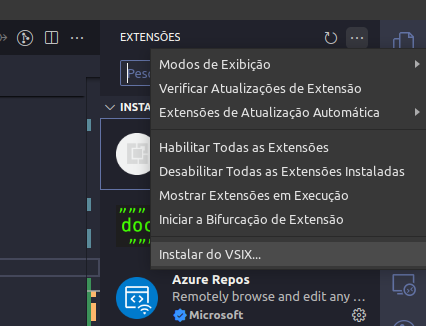

### Execution

To run the ADPP lexical and syntactic analyzer and execute the provided example (quicksort.adpp), follow these steps:

1. **Makefile Setup**: Ensure you have the necessary tools installed, including Lex and GCC.

2. **Compile and Run**:
   - Open a terminal.
   - Navigate to the directory containing the Makefile and ADPP files.
   - Simply type `make` and press Enter.

### Syntax Highlighter
To install the syntax highlighter for VS Code go to
  `Extensions` > `...` > `Install from VSXI...` and select the file `adpp-0.0.1.vsix`
